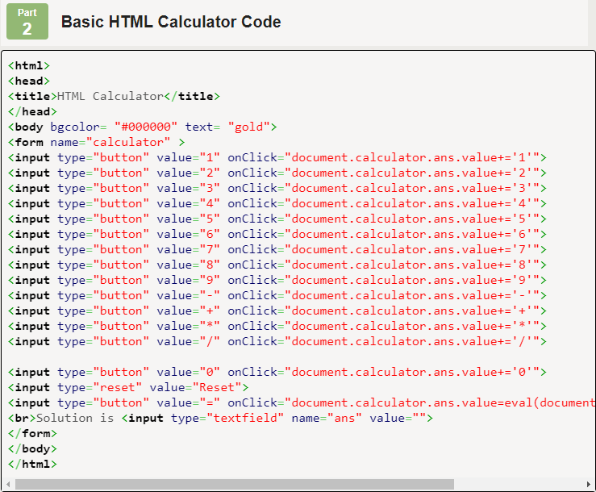

# calculator

Your task is to create a simple calculator that asks the user for two numbers and an operation (+, -, x, ÷), and computes and outputs the result.

## Steps

1. Always start by opening Brackets, creating a new file, and saving it.

    - Save the new file as `calculator.html`.
    - Fill out the basic structure of the HTML from memory, or use a template or past project.

2. Get three inputs from the user, to get the two numbers and the operation.

    - What will you use to get inputs (`prompt()`, HTML `<input>` elements, something else)?
    - How will you tell the users what each input is for?
    - How will they choose the operation? Will they type in the symbol '+', or the word 'plus'? Or maybe choose from a dropdown?

3. In your code, perform the *correct* operation on the two numbers and compute the result.

    - Remember to convert the string inputs into numbers using `parseInt()` or `parseFloat()`.
    - You will need to use if statements to check the chosen operation and perform the correct calculation.
    - If using HTML `<input>` elements, you will need to trigger the calculation somehow (e.g. a `<button>` element).
        - To make the button "do" something, you will need to add an `onclick` attribute and write a JavaScript function for it to call.

4. Display the result to the user.

    - How will you display it? An alert box is easiest, but it looks nicer if you display the answer on the page using `.innerHTML`.
    - Remember to indicate what the displayed number means, like `The answer is: `

5. Use the resources below to guide you through the process.

## Resources

| Concept              | Resource |
|----------------------|----------|
| JavaScript           | <ul><li>[JavaScript script tag](https://www.w3schools.com/js/js_whereto.asp) (put it at the end of `body`)</li><li>[JS Operators](https://www.w3schools.com/js/js_operators.asp)</li></ul> |
| Variables            | <ul><li>[JS Variables](https://www.w3schools.com/js/js_assignment.asp)</li><li>[JS Assignment Operators](https://www.w3schools.com/js/js_assignment.asp)</li></ul> |
| Type conversion      | <ul><li>[Strings to numbers (search `parseInt()` and `parseFloat()` on this page)](https://www.w3schools.com/js/js_number_methods.asp)</li></ul> |
| If statements        | <ul><li>[If statements](https://www.w3schools.com/js/js_if_else.asp)</li></ul> |
| Displaying results   | <ul><li>[JavaScript output summary (W3Schools)](https://www.w3schools.com/js/js_output.asp)</li><li>Option 1: [JS alert box](https://www.w3schools.com/js/js_popup.asp)</li><li>Option 2: [Changing HTML content](https://www.w3schools.com/js/js_htmldom_html.asp)</li><li>Option 3: [console.log](https://www.w3schools.com/jsref/met_console_log.asp)</li></ul> |
| String manipulation  | <ul><li>[String concatenation (or simply use `str1 + str2`)](https://www.w3schools.com/jsref/jsref_concat_string.asp)</li></ul> |

For HTML versions (using `<input>`, buttons, and `.innerHTML`):

| Concept              | Resource |
|----------------------|----------|
| Input elements | <ul><li>[Different input types (W3Schools)](https://www.w3schools.com/tags/att_input_type.asp)</li></ul> |
| Dropdowns   | <ul><li>[HTML select element](https://www.w3schools.com/tags/tag_select.asp)</li></ul> |
| Buttons     | <ul><li>[HTML button element](https://www.w3schools.com/tags/tag_button.asp)</li><li>[Button onclick event (linking to functions)](https://www.w3schools.com/jsref/event_onclick.asp)</li></ul> |
| Getting HTML content | <ul><li>[getElementById() (W3Schools)](https://www.w3schools.com/jsref/met_document_getelementbyid.asp)</li><li>[Input text value property (W3Schools)](https://www.w3schools.com/jsref/prop_text_value.asp)</li><li>[Getting dropdown selection value (W3Schools)](https://www.w3schools.com/jsref/prop_select_value.asp)</li></ul> |

## Assessment

| Level  | Expectations |
|--------|--------------|
| Bronze | Successfully adds, subtracts, multiplies, and divides two numbers |
| Silver | Uses `<input>` and `.innerHTML` to display the interface on the webpage |
| Gold   | More operations, multiple numbers, error-proofing, etc. |

- **Note:** all code should be commented and you should have no redundant code.

Remember to commit each time you've made a major change to your code, and to push to GitHub frequently.

## A note about plagiarism

As you program this module (and others), you may be tempted to search online for a solution you can copy. For instance, code like this is easy to find:

**DO NOT COPY THIS CODE**. This is **not** an appropriate submission. Using a pre-built solution like this:

  - doesn't solve the original problem description (enter two numbers and an operation)
  - is much more complicated than your task
  - doesn't use any of the techniques or conventions we have learned
    - for instance, all of that "onclick" code should be inside functions in a `<script>` block
  - doesn't result in you learning much, or applying the skills you have learned

Please keep that in mind as you program. There is sometimes a fine line in coding between using resources and plagiarising - but what you create must be your own, it should use what you have learned, and you should understand it fully.
