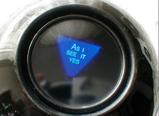

# magic8

A Magic 8-Ball is a toy that pretends to predict the future - you ask it any question, shake the ball, and a random answer appears in the clear window.
The question must be a yes or no question, and the original toy had [20 possible answers](https://en.wikipedia.org/wiki/Magic_8-Ball#Possible_answers).

Your task is to create a Magic 8-Ball for the web that generates a random answer from at least three options: Yes, No, or Maybe.

## Steps

1. Always start by opening Brackets, creating a new file, and saving it.

    - Save the new file as `calculator.html`.
    - Fill out the basic structure of the HTML from memory, or use a template or past project.

2. Get the user's yes/no question, either using `prompt()` or an `<input>` and `<button>`.

    - Remember to give the user clear instructions! You may want to also give a brief welcome message.

3. Generate a random number (see resources).

4. Use `if` statements to display different responses based on the value of the random number.

5. Try challenging yourself by completing the silver, gold, and diamond expectations!

## Resources

For HTML versions (using `<input>`, buttons, and `.innerHTML`):

| Concept              | Resource |
|----------------------|----------|
| Random values        | <ul><li>[JavaScript random](https://www.w3schools.com/js/js_random.asp) (in particular, "random integers")</li><li>getting a random array value - try [Google](https://www.google.com.au/)!</li></ul> |
| If statements        | <ul><li>[If statements](https://www.w3schools.com/js/js_if_else.asp)</li></ul> |
| Displaying results   | <ul><li>[JavaScript output summary (W3Schools)](https://www.w3schools.com/js/js_output.asp)</li><li>Option 1: [JS alert box](https://www.w3schools.com/js/js_popup.asp)</li><li>Option 2: [Changing HTML content](https://www.w3schools.com/js/js_htmldom_html.asp)</li><li>Option 3: [console.log](https://www.w3schools.com/jsref/met_console_log.asp)</li></ul> |
| Arrays               | <ul><li>[JavaScript arrays](https://www.w3schools.com/js/js_arrays.asp) (look at "Creating" and "Access the Elements")</li></ul> |
| General     | <ul><li>[StackOverflow](https://stackoverflow.com/)</li><li>[W3Schools](https://www.w3schools.com/)</li><li>[CSS-Tricks](https://css-tricks.com/)</li><li>[Course Resources](/resources/)</li></ul> |

For HTML versions (using `<input>`, buttons, and `.innerHTML`):

| Concept              | Resource |
|----------------------|----------|
| Input elements | <ul><li>[Different input types (W3Schools)](https://www.w3schools.com/tags/att_input_type.asp)</li></ul> |
| Buttons     | <ul><li>[HTML button element](https://www.w3schools.com/tags/tag_button.asp)</li><li>[Button onclick event (linking to functions)](https://www.w3schools.com/jsref/event_onclick.asp)</li></ul> |
| Getting HTML content | <ul><li>[getElementById() (W3Schools)](https://www.w3schools.com/jsref/met_document_getelementbyid.asp)</li><li>[Input text value property (W3Schools)](https://www.w3schools.com/jsref/prop_text_value.asp)</li><li>[Getting dropdown selection value (W3Schools)](https://www.w3schools.com/jsref/prop_select_value.asp)</li></ul> |

## Assessment

| Level  | Expectations |
|--------|--------------|
| Bronze | Lets the user enter a question, and displays a random response |
| Silver | Recognizes "key phrases" to which it gives unique responses |
| Gold   | HTML integration or uses a while loop to repeat the whole process, asking each time if the user wants to ask another question |
| Diamond | Uses arrays instead of if statements to choose the response |

- **Note:** all code should be commented and you should have no redundant code.

Remember to commit each time you've made a major change to your code, and to push to GitHub frequently.
