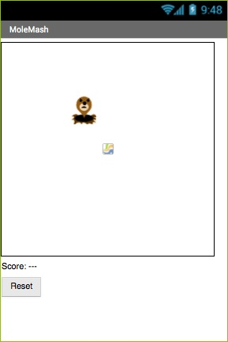

# MoleMash

In [MoleMash](http://appinventor.mit.edu/explore/ai2/molemash.html), you learned how to use canvases and image sprites to make a clickable image.

Your task is to recreate MoleMash for the web. To do so, you will have to learn about divs, imgs, CSS positioning, and click events.

## Steps

Before attempting this module, you should have completed [`HelloWorld`](../HelloWorld/) and [`HelloCodi`](../HelloCodi/).

1. Begin by downloading `template.html` to your working directory, and renaming it `MoleMash.html`.

    - to download a file from GitHub, first click on its link, then **right-click on `Raw`** and "Save link as..."

2. Create a `
` that fills the entire screen (see info about `div`s below).

3. Create an `` within the div, using the Mole image as a source.

4. Give the `
` and the `` ID tags, and use these IDs to give them custom CSS (in the `head`). Specifically, give them both `position: absolute`, and make the div fill the screen.

5. Add a click handler to the image - for now, make it just pop up an alert message saying that you clicked the mole.

6. Create a timer to move the img to a random location (`Math.random`) at regular time intervals (see info about setTimeout below).

7. Create a scoreboard (some text element - you choose!). There are a few options for positioning it on the screen - one option is `position: fixed`.

8. Reprogram your img click handler to increase a score counter and update the scoreboard (no alert message).

9. Add a reset button, positioned appropriately on the screen.

10. See the assessment criteria for how to improve the project further!

## Resources

| Requirement   | Resource |
|---------------|----------|
| Divs          | <ul><li>[Div tag (W3Schools)](https://www.w3schools.com/tags/tag_div.asp)</li><li>[how to make a webpage full-screen](https://stackoverflow.com/a/8464208) (set `html` and `body` to `height: 100%; width: 100%`)</li><li>[Using 100% height in CSS](https://mattboldt.com/css-100-percent-height/)</li></ul> |
| CSS Position  | <ul><li>[Position property (W3Schools)](https://www.w3schools.com/cssref/pr_class_position.asp)</li><li>[CSS layout - position (W3Schools)](https://www.w3schools.com/css/css_positioning.asp)</li></ul> |
| Click event   | <ul><li>[Onclick event (W3Schools)](https://www.w3schools.com/jsref/event_onclick.asp)</li></ul> |
| Timeout       | <ul><li>[setTimeout() method (W3Schools)](https://www.w3schools.com/jsref/met_win_settimeout.asp)</li><li>[clearTimeout() method (W3Schools)](https://www.w3schools.com/jsref/met_win_cleartimeout.asp)</li></ul> |
| General       | <ul><li>[StackOverflow](https://stackoverflow.com/)</li><li>[W3Schools](https://www.w3schools.com/)</li><li>[CSS-Tricks](https://css-tricks.com/)</li><li>[11COM Resources](/resources/)</li></ul> |

## Assessment

| Level  | Expectations |
|--------|--------------|
| Bronze | Image moves randomly on the screen; clicking on it creates an alert message |
| Silver | Working scoreboard and reset button |
| Gold   | Tracks number of misses, has a "kill" screen, etc. |

- **Note:** all code should be commented and you should have no redundant code

At the end of each day, submit a zip of your entire working directory (including this module) on MyNHS.
