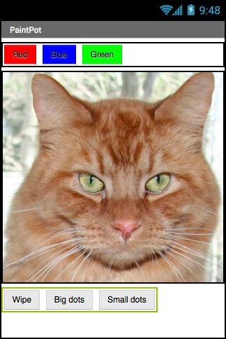

# PaintPot

In PaintPot ([Part 1](http://appinventor.mit.edu/explore/ai2/paintpot-part1.html) and [Part 2](http://appinventor.mit.edu/explore/ai2/paintpot-part2.html)), you learned how to draw on a canvas and use variables.

Your task is to recreate PaintPot for the web. To do so, you will have to learn about HTML5 canvases.

## Steps

1. Before attempting this module, you should have completed [`HelloWorld`](../HelloWorld/) and [`HelloCodi`](../HelloCodi/).

2. Begin by downloading [`template.html`](./template.html) to your working directory, and renaming it `PaintPot.html`.

    - to download a file from GitHub, first click on its link, then **right-click on `Raw`** and "Save link as..."

3. Place three buttons (Red/Blue/Green), a canvas, and three more buttons (Wipe, Big dots, Small dots) in your HTML, and give them appropriate sizes/styles.

4. Use the resources below to guide the rest of the process.

## Resources

| Requirement   | Resource |
|---------------|----------|
| Buttons       | <ul><li>See [HelloCodi](../HelloCodi/) for guidance on buttons</li></ul> |
| Canvas        | <ul><li>[HTML5 Canvas (W3Schools)](https://www.w3schools.com/html/html5_canvas.asp)</li><li>Canvas [lineTo()](https://www.w3schools.com/tags/canvas_lineto.asp), [lineWidth](https://www.w3schools.com/tags/canvas_linewidth.asp), [strokeStyle](https://www.w3schools.com/tags/canvas_strokestyle.asp), [arc()](https://www.w3schools.com/tags/canvas_arc.asp), [fill()](https://www.w3schools.com/tags/canvas_fill.asp) (W3Schools)</li><li>[Clear the canvas for redrawing (StackOverflow)](https://stackoverflow.com/a/2142549/4080966)</li></ul> |
| Mouse input   | <ul><li>[onmousemove](https://www.w3schools.com/jsref/event_onmousemove.asp), [onmousedown](https://www.w3schools.com/jsref/event_onmousedown.asp), and [onmouseup](https://www.w3schools.com/jsref/event_onmouseup.asp) events (W3Schools)</li><li>[Relative mouse position (StackOverflow)](https://stackoverflow.com/a/42111623/4080966)</li><li>[Mouse position - pageX vs screenX vs clientX (StackOverflow)](https://stackoverflow.com/a/9335517)</li></ul> |
| Other         | <ul><li>[CSS Colors (W3Schools)](https://www.w3schools.com/cssref/css_colors_legal.asp)</li></ul> |
| Examples      | <ul><li>Examples: [1](https://www.codicode.com/art/how_to_draw_on_a_html5_canvas_with_a_mouse.aspx), [2](https://stackoverflow.com/a/8398189), [3](https://medium.com/@jagadeshanh/html5-canvas-click-and-draw-f665e02f5744)</li><li>Note: #1 above frequently uses `$()`, which is called jQuery (and is outside the scope of this module), but there are still useful concepts in it</li></ul> |
| General       | <ul><li>[StackOverflow](https://stackoverflow.com/)</li><li>[W3Schools](https://www.w3schools.com/)</li><li>[CSS-Tricks](https://css-tricks.com/)</li><li>[11COM Resources](/resources/)</li></ul> |

## Assessment

| Level  | Expectations |
|--------|--------------|
| Bronze | Clicking and dragging the mouse draws accurate lines on the canvas (only while the mouse button is pressed down) |
| Silver | Dots, colours, and wipe working |
| Gold   | Different sizes of dots and lines, ability to choose background image, etc. |

- **Note:** all code should be commented and you should have no redundant code

At the end of each day, submit a zip of your entire working directory (including this module) on MyNHS.
